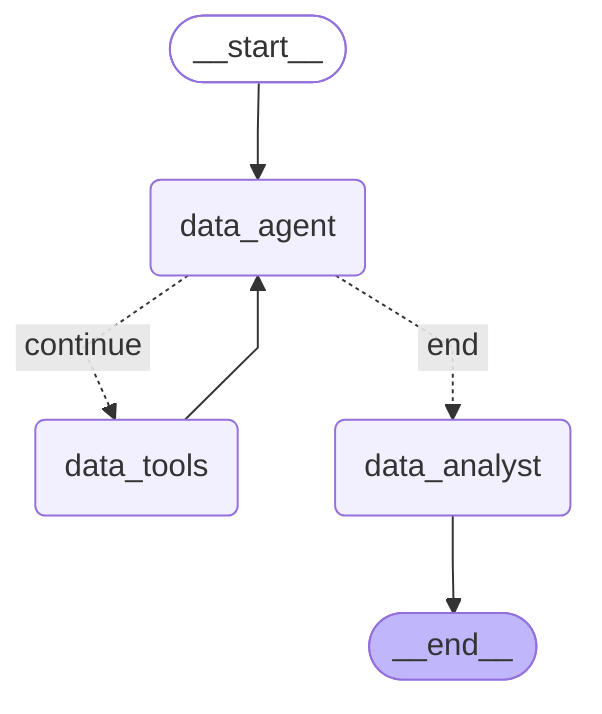

```mermaid
---
config:
  flowchart:
    curve: linear
---
graph TD;
	__start__([<p>__start__</p>]):::first
	data_agent(data_agent)
	data_tools(data_tools)
	data_analyst(data_analyst)
	__end__([<p>__end__</p>]):::last
	__start__ --> data_agent;
	data_agent -. &nbsp;end&nbsp; .-> data_analyst;
	data_agent -. &nbsp;continue&nbsp; .-> data_tools;
	data_tools --> data_agent;
	data_analyst --> __end__;
	classDef default fill:#f2f0ff,line-height:1.2
	classDef first fill-opacity:0
	classDef last fill:#bfb6fc

```